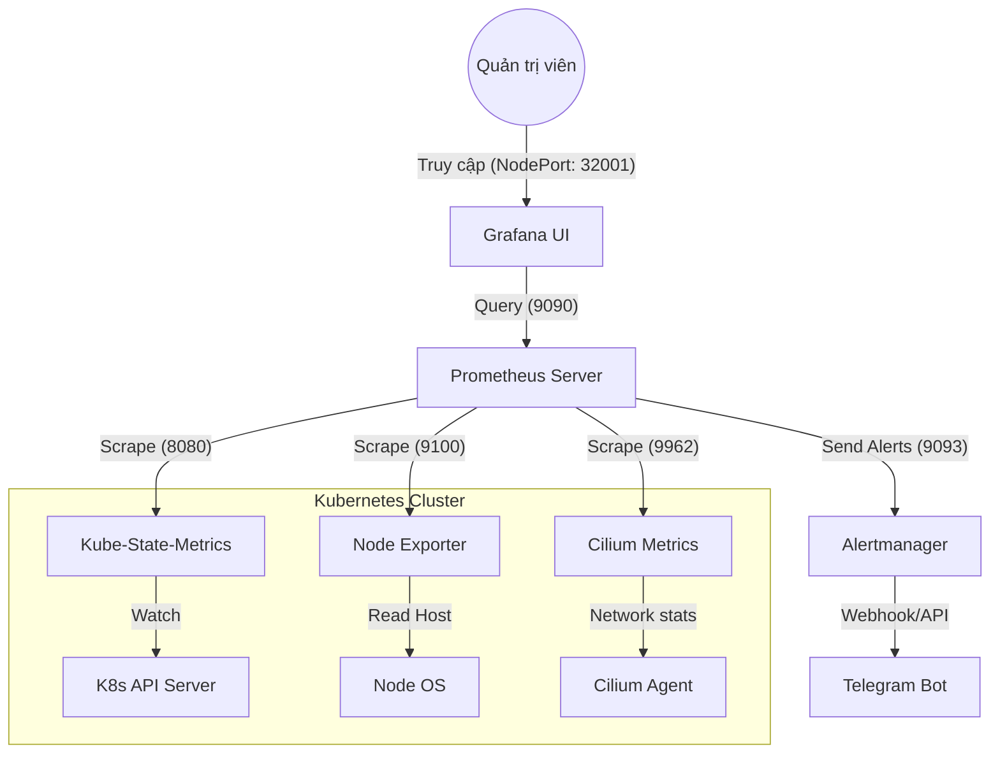

# Kiến Trúc Hệ Thống Giám Sát Kubernetes (Prometheus Stack)

Tài liệu này giải thích chi tiết cấu hình và luồng hoạt động của các thành phần trong thư mục `k8s_monitoring`, được triển khai trên Kubernetes Cluster.

---

## 1. Thành Phần Hệ Thống

Hệ thống được xây dựng theo mô hình **Pull-based monitoring**, bao gồm các thành phần chính:

| Thành phần | Vai trò | Cấu hình chính |
| :--- | :--- | :--- |
| **Prometheus** | Bộ não trung tâm, thu thập và lưu trữ metrics. | [prometheus_configmap.yaml](../k8s_monitoring/prometheus/prometheus_configmap.yaml) |
| **Node Exporter** | Thu thập thông số phần cứng (CPU, RAM, Disk) của Node. | [node_exporter_daemonset.yaml](../k8s_monitoring/node_exporter/node_exporter_daemonset.yaml) |
| **Kube-State-Metrics** | Xuất metrics về trạng thái đối tượng K8s (Pod, Deployment, Node). | [ksm_deployment.yaml](../k8s_monitoring/kube_state_metrics/ksm_deployment.yaml) |
| **Alertmanager** | Xử lý và gửi thông báo cảnh báo (Telegram). | [alertmanager-config.yaml](../k8s_monitoring/alert_manager/alertmanager-config.yaml) |
| **Grafana** | Giao diện hiển thị biểu đồ và dashboard. | [grafana-deployment.yaml](../k8s_monitoring/grafana/grafana-deployment.yaml) |

---

## 2. Sơ Đồ Kiến Trúc & Luồng Dữ Liệu

### Giải thích luồng:
1. **Thu thập (Scraping):** Cứ mỗi 5 giây (`scrape_interval: 5s`), Prometheus gửi yêu cầu HTTP tới `/metrics` của các target.
2. **Cảnh báo (Alerting):** Prometheus kiểm tra các quy tắc (Rules). Nếu thỏa mãn điều kiện `up == 0` (Instance Down), nó gửi cảnh báo tới Alertmanager.
3. **Thông báo (Notification):** Alertmanager nhận cảnh báo, định tuyến (Routing) và gửi tới Telegram qua Bot API.
4. **Hiển thị (Visualizing):** Grafana truy vấn Prometheus và hiển thị lên Dashboard cho người dùng.

---

## 3. Phân Tích Chuyên Sâu Cấu Hình

### 3.1. Prometheus (Central Intelligence)
Trong file `prometheus_configmap.yaml`, các Job được định nghĩa để thu thập dữ liệu từ các nguồn khác nhau:
- **`node-exporter`**: Sử dụng danh sách IP tĩnh (`172.18.0.61-63`). Điều này phù hợp với hạ tầng có IP Node cố định.
- **`kube-state-metrics`**: Kết nối qua DNS nội bộ `kube-state-metrics.monitoring.svc.cluster.local`.
- **`alert_manager`**: Prometheus được cấu hình để "biết" địa chỉ của Alertmanager nhằm đẩy cảnh báo đi.

### 3.1. Node Exporter (Infrastructure Monitoring)
- Được triển khai dưới dạng **DaemonSet** để đảm bảo mỗi Node đều có 1 Pod giám sát.
- **`hostNetwork: true`**: Cho phép truy cập trực tiếp vào stack mạng của Host.
- **`hostPath` mount**: Gắn thư mục `/` của Host vào `/host` trong container để đọc thông số disk và hệ thống.

### 3.3. Alertmanager (Notification Handler)
- Cấu hình trong `alertmanager.yml` chỉ định receiver là **Telegram**.
- Sử dụng `bot_token` và `chat_id` để kết nối với API của Telegram.
- **`resolve_timeout: 5m`**: Thời gian chờ trước khi một cảnh báo được coi là đã được xử lý (nếu không còn nhận được dữ liệu lỗi).

### 3.4. RBAC (Quyền truy cập)
- File `ksm_rbac.yaml` cấp quyền `list` và `watch` cho ServiceAccount `kube-state-metrics`. 
- Nếu thiếu file này, KSM sẽ không thể đọc dữ liệu từ API Server và Prometheus sẽ không có dữ liệu về Pod/Node status.

---

## 4. Vai trò của các Kubernetes Service (Giao tiếp nội bộ)

Trong hệ thống này, các **Service** đóng vai trò cực kỳ quan trọng, là "chìa khóa" để các thành phần có thể tìm thấy và nói chuyện với nhau một cách ổn định.

### 4.1. Tại sao phải dùng Service?
- **DNS ổn định:** Thay vì phải nhớ IP của từng Pod (vốn sẽ thay đổi khi Pod bị restart), các thành phần chỉ cần gọi tên (ví dụ: `http://prometheus`).
- **Load Balancing:** Nếu bạn chạy nhiều bản sao (Replica) cho một dịch vụ, Service sẽ tự động cân bằng tải giữa các Pod đó.

### 4.2. Chi tiết chức năng từng Service
- **Service `prometheus`:** 
    - *Tác dụng:* Là "Data Source" cho Grafana. Khi bạn cấu hình Grafana, bạn sẽ trỏ URL về `http://prometheus:9090`.
- **Service `alertmanager`:** 
    - *Tác dụng:* Tiếp nhận cảnh báo. Trong file `prometheus_configmap.yaml`, dòng `targets: ['alertmanager:9093']` chính là gọi tên Service này.
- **Service `node-exporter`:** 
    - *Tác dụng:* Gom các metrics phần cứng từ tất cả các Node. Prometheus sẽ "quét" qua Service này để lấy dữ liệu.
- **Service `kube-state-metrics`:** 
    - *Tác dụng:* Cung cấp endpoint `/metrics` định dạng chuẩn để Prometheus kéo thông tin về trạng thái các object (Pod, Node, Namespace).
- **Service `grafana` (NodePort):** 
    - *Tác dụng:* Đây là "cửa ngõ" cho con người. Loại `NodePort` cho phép bạn truy cập từ máy tính cá nhân vào Cluster thông qua IP của Node và Port `32001`.

---

## 5. Các Port Giao Tiếp Quan Trọng

| Port | Dịch vụ | Chức năng |
| :--- | :--- | :--- |
| **9090** | Prometheus | Dashboard và API Query. |
| **9093** | Alertmanager | Tiếp nhận cảnh báo từ Prometheus. |
| **9100** | Node Exporter | Cung cấp thông số phần cứng Node. |
| **8080** | KSM | Cung cấp thông số trạng thái vật thể K8s. |
| **3000** | Grafana | Giao diện người dùng (User Interface). |
| **32001** | Grafana (NodePort) | Cổng truy cập từ bên ngoài Cluster. |

---
> [!IMPORTANT]
> Toàn bộ hệ thống này nằm trong namespace `monitoring`. Khi sửa đổi cấu hình, hãy đảm bảo các Service Name và Port luôn khớp với cấu hình trong ConfigMap của Prometheus.
