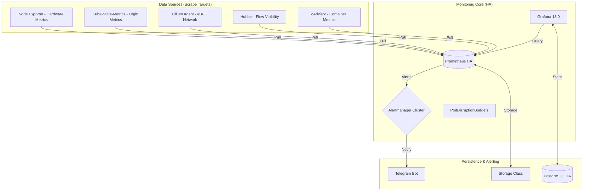

# ☸️ Master Guide: Kubernetes High-Availability Monitoring Stack (SRE Standard)

Tài liệu này cung cấp cái nhìn **chi tiết mức độ chuyên gia** về hệ thống giám sát đã được tối ưu hóa cho môi trường Production, sẵn sàng cho buổi trình bày POC.

---

## 🏗️ 1. Kiến trúc tổng thể (Architecture Deep-Dive)

Hệ thống sử dụng mô hình **Pull-based Monitoring** kết hợp với kiến trúc **High-Availability (HA)** ở mọi tầng lớp.

### Điểm nhấn kỹ thuật:
1. **StatefulSet & PVC:** Prometheus và Alertmanager không chạy dưới dạng Deployment thông thường mà là `StatefulSet`. Điều này đảm bảo mỗi Pod có một danh tính DNS cố định và một ổ đĩa cứng (PVC) riêng biệt không đổi kể cả khi Pod bị restart.
2. **Clustering (Gossip Protocol):** 3 Pod Alertmanager liên kết với nhau qua cổng `9094`. Khi bạn bấm "Silence" (Tắt thông báo) trên Pod 1, thông tin này ngay lập tức được "truyền tai" tới Pod 2 và 3, đảm bảo hệ thống luôn đồng nhất.
3. **External DB for Grafana:** Thay vì dùng SQLite (dễ lỗi khi scale), Grafana được kết nối với cụm **PostgreSQL HA**. Điều này cho phép Grafana scale ngang vô tận mà không mất Dashboard hay Session người dùng.

---

## ⚙️ 2. Phân tích Manifest (Line-by-Line Logic)

Mọi file cấu hình đều tuân thủ các tiêu chuẩn bảo mật và vận hành khắt khe nhất:

### 🛡️ Bảo mật & Tài nguyên
- **Non-Root Execution:** Tất cả container đều chạy với `runAsNonRoot: true` và UID `65534` (nobody) hoặc `472` (grafana). Điều này ngăn chặn hacker leo thang đặc quyền từ container ra Node vật lý.
- **Resource Management:** Mọi Pod đều có `requests` (Tài nguyên cam kết) và `limits` (Ngưỡng tối đa). Điều này ngăn chặn tình trạng một cấu hình Prometheus sai có thể "ăn sạch" RAM của toàn bộ Node vật lý.
- **fsGroup:** Sử dụng `fsGroup` trong `securityContext` để Kubernetes tự động gán quyền ghi vào ổ đĩa gắn kèm cho user chạy ứng dụng.

### ⚓ Tính sẵn sàng cao (HA Mechanisms)
- **Pod Anti-Affinity:** Sử dụng logic "Hard Requirements" để ép buộc các Pod cùng loại (ví dụ 2 Pod Prometheus) KHÔNG bao giờ được nằm chung trên cùng một Node vật lý. Nếu một Node cháy, các Node khác vẫn còn Pod hoạt động.
- **Pod Disruption Budget (PDB):** Thiết lập `minAvailable`. Ví dụ với Alertmanager có 3 Pod, PDB yêu cầu luôn có 2 Pod sống. Khi bạn nâng cấp Cluster hoặc bảo trì Node, hệ thống sẽ ngăn cản việc tắt Pod nếu không đảm bảo đủ số lượng an toàn này.

---

## 📉 3. "Não bộ" Prometheus: Logic Relabeling & Rules

Đây là phần phức tạp nhất, giúp dữ liệu trở nên sạch và dễ nhìn:

### 🏷️ Relabeling Logic:
- **Đồng bộ Instance:** Prometheus mặc định lấy `IP:Port` làm nhãn `instance`. Chúng tôi đã cấu hình `relabel_configs` để ép nhãn này thành **Tên Node thực tế**. Nhờ đó, bạn có thể lọc dữ liệu theo "Node-01", "Node-02" thay vì các địa chỉ IP vô nghĩa.
- **Drop Metrics cực đoan:** Để tiết kiệm dung lượng, hệ thống chỉ giữ lại những Metric thực sự cần thiết qua `metric_relabel_configs` (Regex filter).

### 🧮 SRE Golden Signals (Mục tiêu POC):
Chúng tôi đã cài đặt sẵn các **Recording Rules** để tính toán trước các chỉ số vàng của SRE:
1. **CPU Throttling (`pod:cpu_throttling:rate5m`):** Phát hiện ứng dụng bị lag do giới hạn CPU quá thấp (Dấu hiệu của Saturation).
2. **Availability (`kube:deployment:availability`):** Tính toán tức thì % Readiness của toàn bộ ứng dụng trong Cluster.
3. **Network Drops (`network:hubble:drop_rate:5m`):** Phân tích xem gói tin bị rớt do lỗi hạ tầng hay do **Network Policy** chặn.

---

## 🛰️ 4. Tầm nhìn mạng với Hubble (Cilium eBPF)

Điểm khác biệt của hệ thống này so với các hệ thống monitoring thông thường là khả năng quan sát mạng tầng sâu:
- **Lấy dữ liệu từ eBPF:** Hubble đọc trực tiếp từ nhân Linux hệ điều hành, cho phép nhìn thấy mọi gói tin mà không cần cài đặt thêm "sidecar" vào từng Pod приложения.
- **DNS Visibility:** Theo dõi độ trễ của các truy vấn DNS. Nếu ứng dụng của bạn không kết nối được Database, bạn sẽ biết ngay là do lỗi Code hay lỗi DNS.
- **Policy Enforcement:** Prometheus sẽ báo động (`HighNetworkDropRate`) nếu phát hiện một lượng lớn gói tin bị "Drop" bởi quy tắc bảo mật mạng.

---

## 🛠️ 5. Vận hành & Xử lý sự cố (Troubleshooting)

### Thứ tự triển khai chuẩn (POC Order):
1. `kubectl apply -f storage-class.yaml` (Nếu chưa có).
2. `cd kube_state_metrics/ && kubectl apply -f .`
3. `cd ../node_exporter/ && kubectl apply -f .`
4. `cd ../prometheus/ && kubectl apply -f .`
5. `cd ../alert_manager/ && kubectl apply -f .`
6. `cd ../grafana/ && kubectl apply -f .`

### Các lỗi thường gặp và cách xử lý:
- **Pod bị "Pending":** Kiểm tra `kubectl get pvc -n monitoring`. Nếu PVC chưa ở trạng thái `Bound`, nghĩa là Storage Class chưa hỗ trợ cấp phát động.
- **Metric không hiển thị trên Dashboard:** 
    - Kiểm tra `Targets` trong Prometheus (`kubectl port-forward svc/prometheus 9090 -n monitoring`).
    - Đảm bảo Pod `node-exporter` hoặc `KSM` đang ở trạng thái `Running`.
- **Alertmanager không bắn tin nhắn:** Kiểm tra `logs` của Pod Alertmanager xem có lỗi `401 Unauthorized` (Sai Token Bot) hoặc lỗi mạng.

---
*Tài liệu này được soạn thảo chuyên sâu phục vụ riêng cho mục đích triển khai POC Monitoring High-Availability.*
