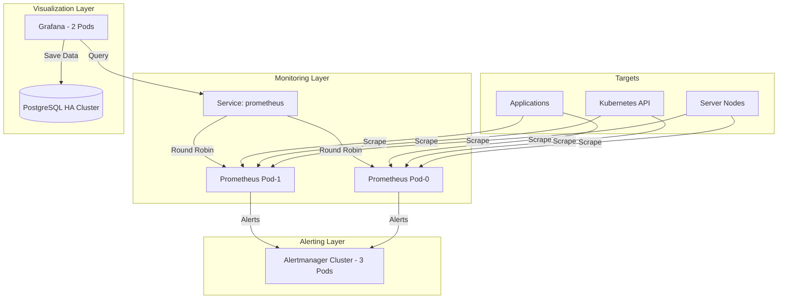

# Tài liệu Kiến trúc Monitoring Simple HA (Cơ bản - Tin cậy - Hiệu quả)

Tài liệu này mô tả kiến trúc của hệ thống giám sát đã được đơn giản hóa để đạt mức High Availability (HA) cơ bản mà không cần sử dụng các thành phần phức tạp như Thanos hay Object Storage.

---

## 1. Sơ đồ Kiến trúc (Architecture Diagram)

Hệ thống hoạt động theo mô hình **Thu thập dư thừa (Redundant Scraping)** và **Cân bằng tải UI**.

---

## 2. Vai trò của từng thành phần

### 🚀 Prometheus (Tầng Thu thập)
- **Cấu hình**: Chạy 2 Pod (`prometheus-0`, `prometheus-1`) trong một StatefulSet.
- **Tác dụng**: Cả 2 Pod cùng đi thu thập dữ liệu (scrape) từ cùng một danh sách các máy chủ và ứng dụng.
- **Tính HA**: Dự phòng 1:1. Nếu một Pod bị lỗi, Pod kia vẫn có dữ liệu liên tục để phục vụ giám sát.

### 📊 Grafana (Tầng Hiển thị)
- **Cấu hình**: Chạy 2 bản sao (Replicas).
- **Tác dụng**: Cung cấp giao diện biểu đồ cho người dùng. 
- **Tính HA**: Đảm bảo giao diện luôn sẵn sàng dù một Pod Grafana bị sập. Kết nối tới Prometheus thông qua Service chuẩn của K8s.

### 🐘 PostgreSQL HA (Tầng Lưu trữ trạng thái)
- **Cấu hình**: Cụm 3 Pod được quản lý bởi CloudNativePG.
- **Tác dụng**: Lưu trữ "trí nhớ" của Grafana bao gồm: Tài khoản người dùng, các Dashboard đã tạo, cấu hình nguồn dữ liệu.
- **Tính HA**: Có khả năng tự động bầu chọn Primary mới (Failover) nếu Pod chính bị hỏng. Đảm bảo bạn không bao giờ bị mất các Dashboard dày công xây dựng.

### 🔔 Alertmanager (Tầng Cảnh báo)
- **Cấu hình**: Cụm 3 Pod chạy theo mô hình Gossip Mesh.
- **Tác dụng**: Nhận cảnh báo từ Prometheus và gửi đi (Email/Slack).
- **Tính HA**: Các Pod tự "nói chuyện" với nhau để thống nhất chỉ gửi 1 thông báo duy nhất, tránh việc người dùng nhận 3 tin nhắn trùng lặp cho cùng một lỗi.

---

## 3. Cơ chế giao tiếp giữa các thành phần

1.  **Dữ liệu Metric (Scrape)**: Prometheus chủ động gọi trực tiếp tới các IP của Node Exporter hoặc Applications để lấy thông tin (Pull model).
2.  **Truy vấn (Query)**: Grafana gọi tới Service `prometheus:9090`. Kubernetes sẽ tự động điều hướng yêu cầu này tới một trong hai Pod đang sống.
3.  **Lưu trữ (State persistence)**: Grafana kết nối tới database thông qua Service `postgres-ha-rw:5432`. Đây là Service luôn trỏ về Pod đang đóng vai trò Primary.
4.  **Cảnh báo (Alerting)**: Khi Prometheus phát hiện lỗi, nó gửi HTTP request tới Service `alertmanager`.

---

## 4. Tại sao kiến trúc này lại phù hợp?

1.  **Đơn giản hóa**: Loại bỏ hoàn toàn sự phụ thuộc vào MinIO và Thanos, giúp giảm độ phức tạp trong vận hành.
2.  **Tận dụng tối đa K8s**: Sử dụng Service ClusterIP để cân bằng tải và StatefulSet để giữ định danh cho Prometheus.
3.  **Độ tin cậy cao**: Mặc dù không có cơ chế gộp dữ liệu nâng cao, nhưng việc thu thập dư thừa và Database HA đã giải quyết được 90% các bài toán sự cố thông thường trong Production.

*Tài liệu soạn thảo cho dự án VNPost K8s Monitoring.*
